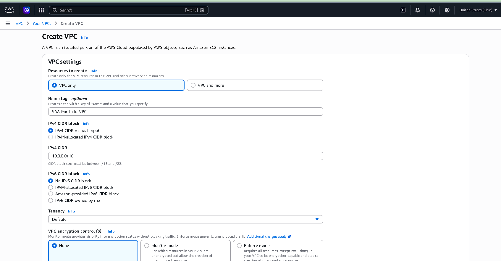
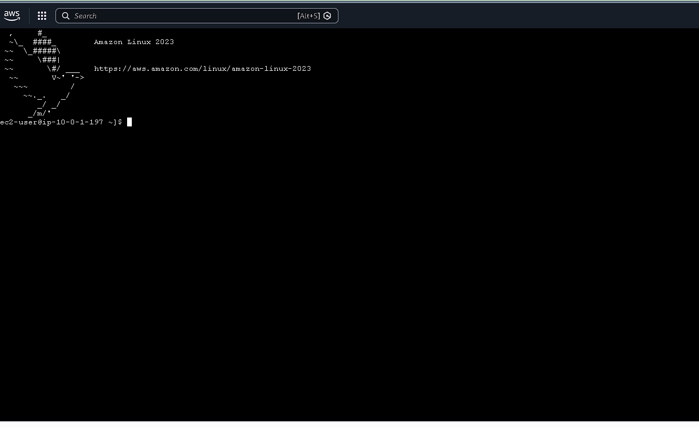
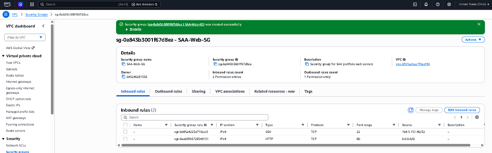
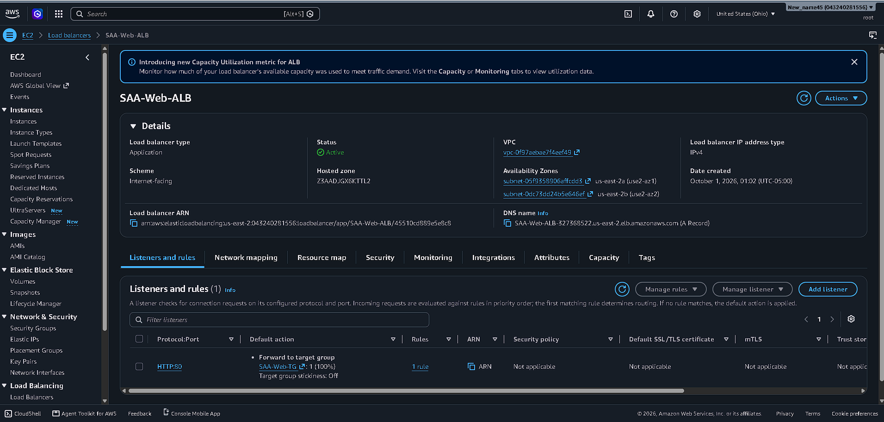
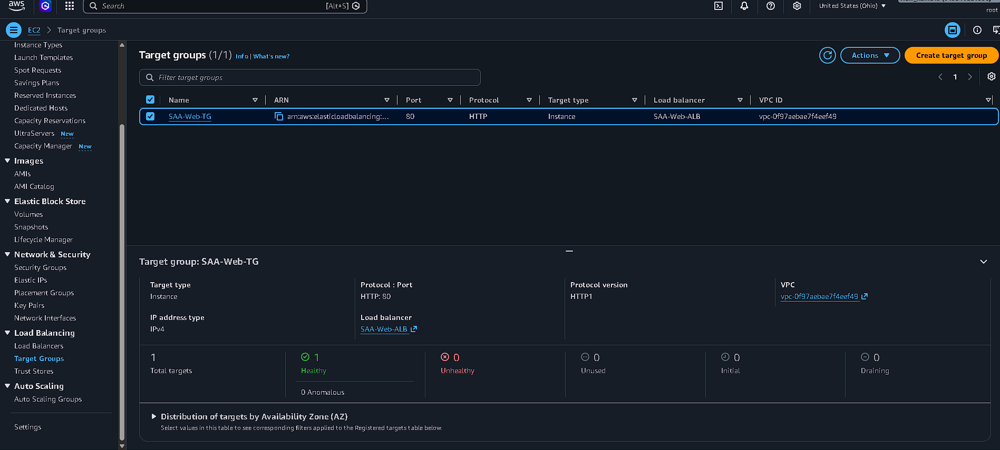
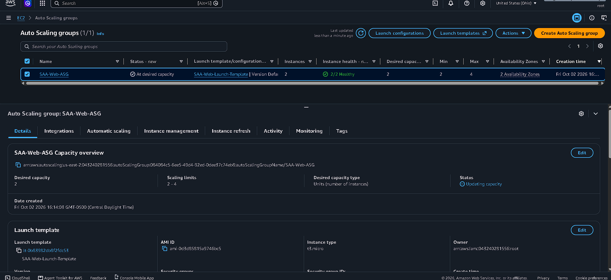
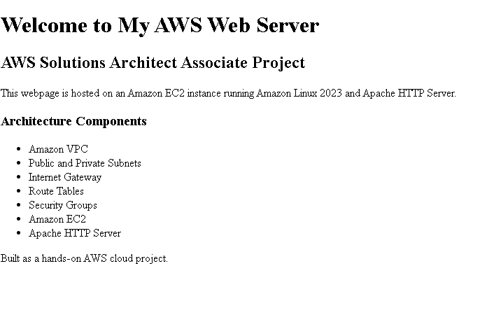

# AWS Solutions Architect – AWS Web Application Architecture :wrench::computer:

## Project Overview

Hands-on AWS Solutions Architect project demonstrating the deployment of a web application architecture using Amazon VPC, Amazon EC2, Application Load Balancer (ALB), target groups, security groups, public subnets, and private network resources.

The project was built from the AWS Management Console to practice core networking, compute, security, load-balancing, and troubleshooting concepts relevant to the AWS Solutions Architect Associate certification.


## Architecture

The environment includes:

- Amazon VPC
- Public and private subnets
- Internet Gateway
- Route tables
- Amazon EC2
- Amazon EC2 Auto Scaling
- Apache HTTP Server
- Application Load Balancer
- ALB target group
- Security groups
- Availability Zones


### Architecture Diagram:


### Traffic Flow :arrow_up::arrow_down:

```text
Internet
   |
   v
Application Load Balancer
   |
   v
SAA-Web-TG
   |
   +-------------------+
   |                   |
   v                   v
EC2 Web Server A    EC2 Web Server B
us-east-2a          us-east-2b
   |                   |
   +------ Apache -----+

        ^
        |
SAA-Web-ASG
manages EC2 capacity
```

# AWS Services Used

### AWS Services :iphone::arrows_clockwise:

- **Amazon VPC** — Provides the isolated network environment
- **Public Subnets** — Host internet-facing resources
- **Private Subnets** — Provide isolated network space for application resources
- **Internet Gateway** — Provides internet connectivity for public resources
- **Route Tables** — Control traffic routing within the VPC
- **Amazon EC2** — Hosts the web application
- **Application Load Balancer** — Distributes HTTP traffic to registered targets
- **Target Group** — Registers targets and performs health checks
- **Security Groups** — Control inbound and outbound network traffic
- **Amazon EC2 Auto Scaling** — Automatically manages EC2 instance capacity

# Implementation

##### 1. Networking

Created an Amazon VPC with CIDR block:

10.0.0.0/16

Configured public and private subnet resources across multiple Availability Zones.



##### 2. EC2 Web Server

Deployed an Amazon EC2 instance running:

Amazon Linux 2023
Apache HTTP Server
HTTP traffic on port 80



The web server hosts a custom HTML page created for this project.

##### 3. Security Groups

Configured separate security groups for the Application Load Balancer and web servers.

The security groups were configured to control HTTP and SSH access to the AWS resources.



##### 4. Application Load Balancer

Created an internet-facing Application Load Balancer across multiple Availability Zones.

Configured:

HTTP listener
Port 80
Target group forwarding
EC2 instance registration
Health checks



##### 5. Target Group

Created the target group:

SAA-Web-TG

The EC2 web servers were registered on port 80.

The registered targets successfully passed the ALB health checks and were reported as Healthy.




##### 6. EC2 Auto Scaling

Created an Amazon EC2 Auto Scaling Group:

- Auto Scaling Group: `SAA-Web-ASG`
- Launch Template: `SAA-Web-Launch-Template`
- Minimum capacity: 2
- Desired capacity: 2
- Maximum capacity: 4
- Availability Zones: `us-east-2a`, `us-east-2b`

The Auto Scaling Group was integrated with the `SAA-Web-TG` target group and successfully launched and maintained EC2 instances across multiple Availability Zones.



# Testing

The Application Load Balancer DNS name was tested from a web browser.

The ALB successfully routed HTTP traffic to the registered EC2 instances through the `SAA-Web-TG` target group.

The target group successfully reported healthy EC2 targets across:

- `us-east-2a`
- `us-east-2b`

The web servers returned their custom HTML pages, confirming connectivity through the Application Load Balancer.

##### Validated Architecture

```text
Internet
   ↓
Application Load Balancer
   ↓
SAA-Web-TG
   ↓
EC2 Web Servers
   ↓
Apache HTTP Server
```

# Key Architecture Concepts Demonstrated:

* VPC networking
* Public vs. private subnet design
* Internet Gateway routing
* Security group configuration
* EC2 deployment
* Application Load Balancing
* Target group registration
* Health checks
* Multi-AZ load balancer configuration
* HTTP traffic routing
* AWS infrastructure troubleshooting
* EC2 Auto Scaling
* Launch templates

## Project Outcome
#### Web Server A:



#### Web Server B:


Successfully deployed and tested an AWS multi-AZ web application architecture using:

- Amazon VPC
- Amazon EC2
- Amazon EC2 Auto Scaling
- Application Load Balancer
- Target Groups
- Security Groups
- Apache HTTP Server

The Application Load Balancer successfully distributed HTTP traffic to healthy EC2 web servers across multiple Availability Zones.

The project also provided hands-on experience with Auto Scaling, load balancing, health checks, VPC networking, security groups, EC2 administration, and AWS infrastructure troubleshooting.
