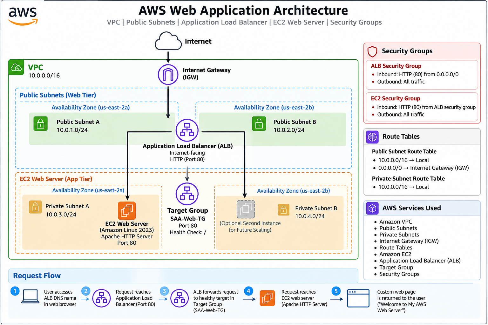

# AWS Solutions Architect – AWS Web Application Architecture :wrench::computer:

## Project Overview

Hands-on AWS Solutions Architect project demonstrating the deployment of a web application architecture using Amazon VPC, Amazon EC2, Application Load Balancer (ALB), target groups, security groups, public subnets, and private network resources.

The project was built from the AWS Management Console to practice core networking, compute, security, load-balancing, and troubleshooting concepts relevant to the AWS Solutions Architect Associate certification.


## Architecture

The environment includes:

- Amazon VPC
- Public and private subnets
- Internet Gateway
- Route tables
- Amazon EC2
- Apache HTTP Server
- Application Load Balancer
- ALB target group
- Security groups
- Availability Zones

### Architecture Diagram



### Traffic Flow :arrow_up::arrow_down:

```text
Internet
   |
   v
Application Load Balancer
   |
   v
ALB Target Group
   |
   v
Amazon EC2 Web Server
   |
   v
Apache HTTP Server
```

# AWS Services Used

### AWS Services :iphone::arrows_clockwise:

- **Amazon VPC** — Provides the isolated network environment
- **Public Subnets** — Host internet-facing resources
- **Private Subnets** — Provide isolated network space for application resources
- **Internet Gateway** — Provides internet connectivity for public resources
- **Route Tables** — Control traffic routing within the VPC
- **Amazon EC2** — Hosts the web application
- **Application Load Balancer** — Distributes HTTP traffic to registered targets
- **Target Group** — Registers targets and performs health checks
- **Security Groups** — Control inbound and outbound network traffic

# Implementation

##### 1. Networking

Created an Amazon VPC with CIDR block:

10.0.0.0/16

Configured public and private subnet resources across multiple Availability Zones.

##### 2. EC2 Web Server

Deployed an Amazon EC2 instance running:

Amazon Linux 2023
Apache HTTP Server
HTTP traffic on port 80

The web server hosts a custom HTML page created for this project.

##### 3. Security Groups

Configured separate security groups for the Application Load Balancer and web server.

The web server security group allows HTTP traffic from the Application Load Balancer security group rather than allowing unrestricted internet access directly to the instance.

##### 4. Application Load Balancer

Created an internet-facing Application Load Balancer across multiple Availability Zones.

Configured:

HTTP listener
Port 80
Target group forwarding
EC2 instance registration
Health checks

##### 5. Target Group

Created the target group:

SAA-Web-TG

The EC2 web server was registered on port 80.

The target successfully passed the ALB health check and was reported as Healthy.

# Testing

The Application Load Balancer DNS name was tested from a web browser.

The request successfully reached the EC2 instance through the Application Load Balancer and returned the custom web page:

"Welcome to My AWS Web Server"

##### This confirmed connectivity between:
```text
Internet
   ↓
Application Load Balancer
   ↓
Target Group
   ↓
EC2
   ↓
Apache HTTP Server
```
# Key Architecture Concepts Demonstrated:

* VPC networking
* Public vs. private subnet design
* Internet Gateway routing
* Security group configuration
* EC2 deployment
* Application Load Balancing
* Target group registration
* Health checks
* Multi-AZ load balancer configuration
* HTTP traffic routing
* AWS infrastructure troubleshooting

## Project Outcome

Successfully deployed and tested an AWS web application architecture using Amazon VPC, EC2, an internet-facing Application Load Balancer, target groups, security groups, and multi-AZ networking.

The Application Load Balancer successfully routed HTTP traffic to the registered EC2 web server, which returned the custom web application page.

This project provided hands-on experience with AWS networking, load balancing, security group configuration, EC2 administration, health checks, and infrastructure troubleshooting.
